## 计算机毕业设计Django+Vue.js汽车数据可视化 Python汽车推荐系统 懂车帝汽车爬虫 汽车大数据 汽车数据分析 机器学习 深度学习 知识图谱 Hadoop Spark

## 要求
### 源码有偿！一套(论文 PPT 源码+sql脚本+教程)

### 
### 加好友前帮忙start一下，并备注github有偿纯python汽车分析
### 我的QQ号是2827724252或者798059319或者 1679232425或者微信:bysj2023nb 或bysj1688

# 

### 加qq好友说明（被部分 网友整得心力交瘁）：
    1.加好友务必按照格式备注
    2.避免浪费各自的时间！
    3.当“客服”不容易，repo 主是体面人，不爆粗，性格好，文明人。

演示视频
https://www.bilibili.com/video/BV1ti421Y7hs/?spm_id_from=333.999.0.0

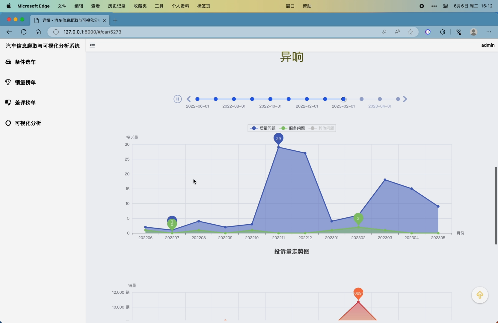
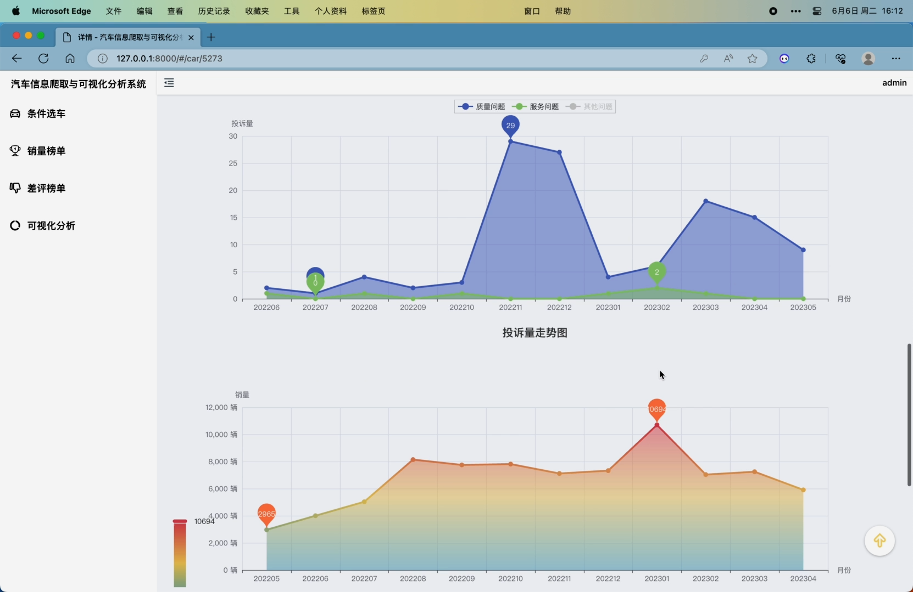
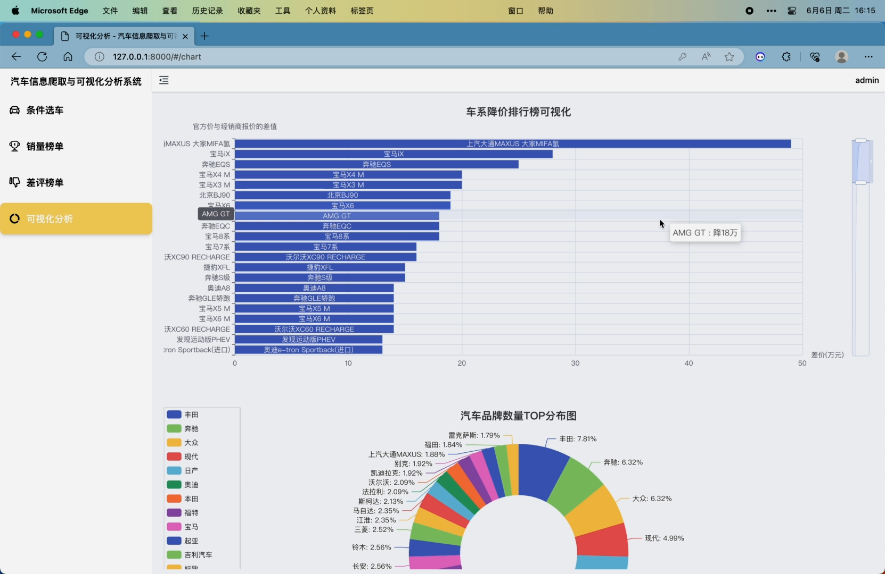
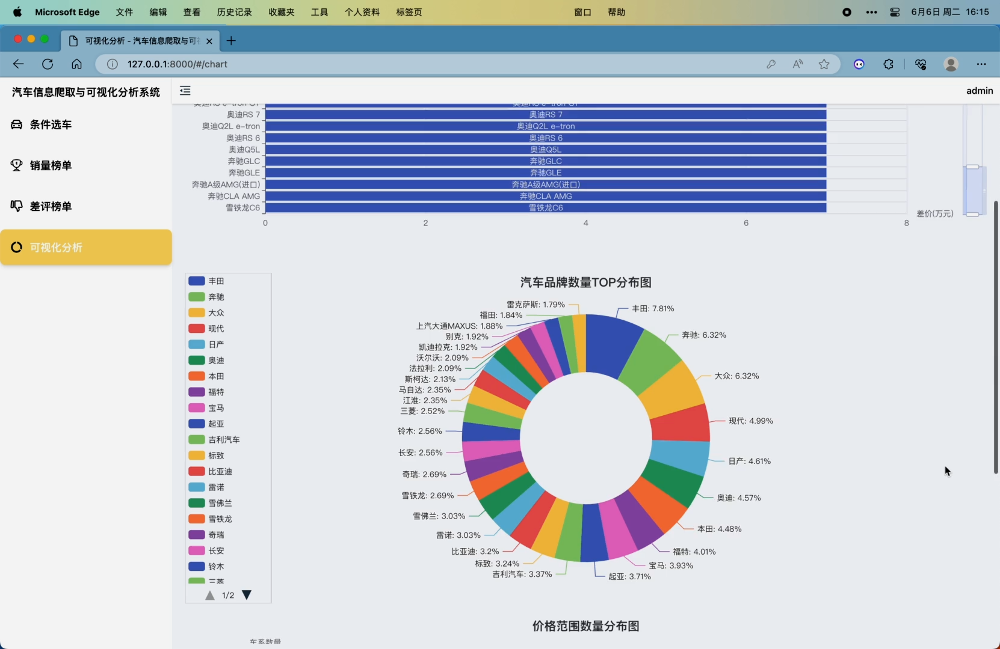
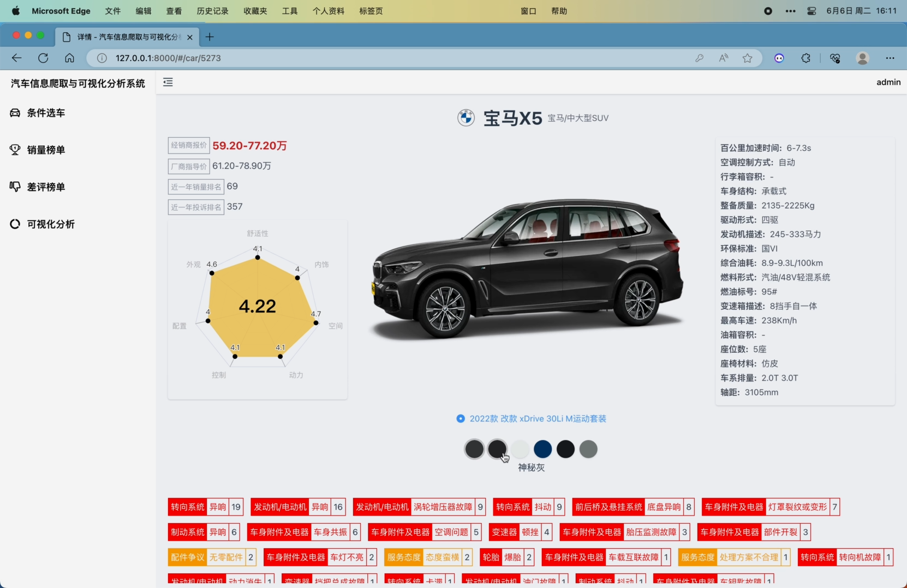
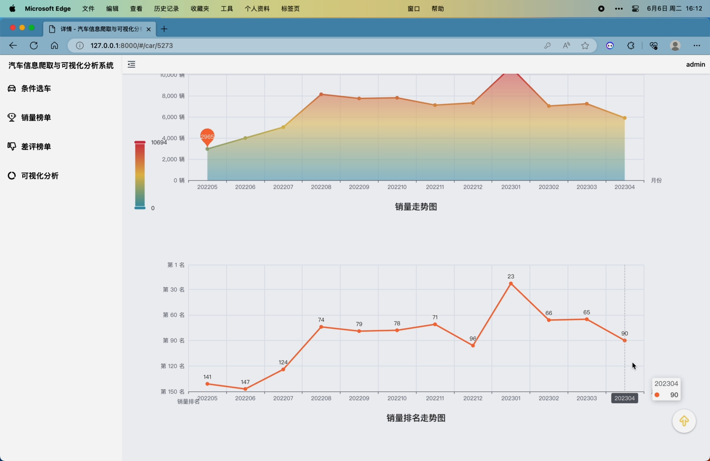
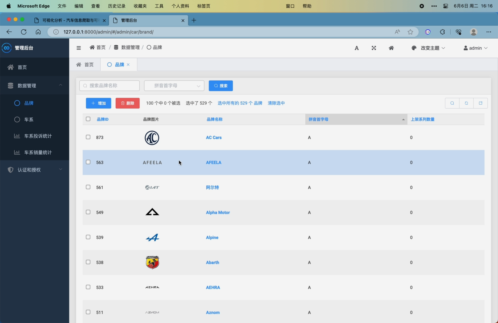
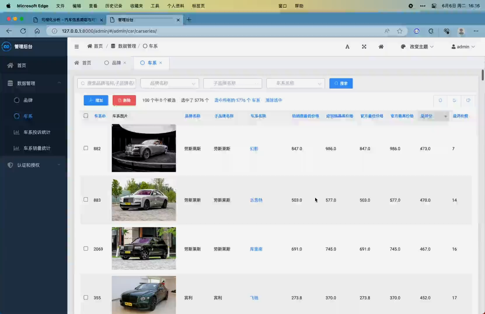
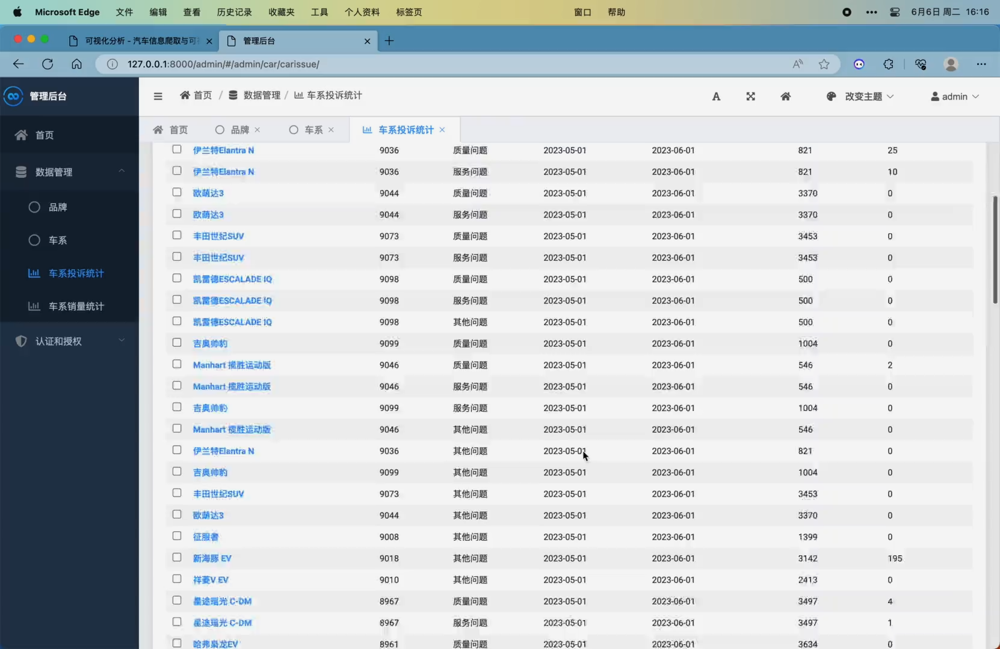
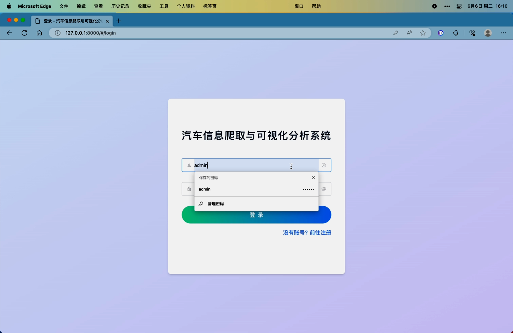
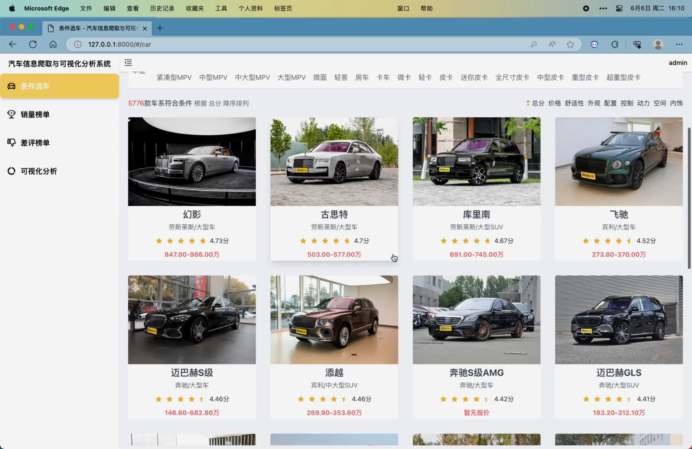
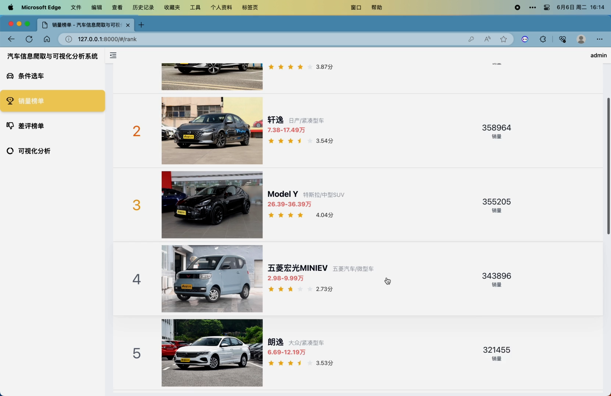
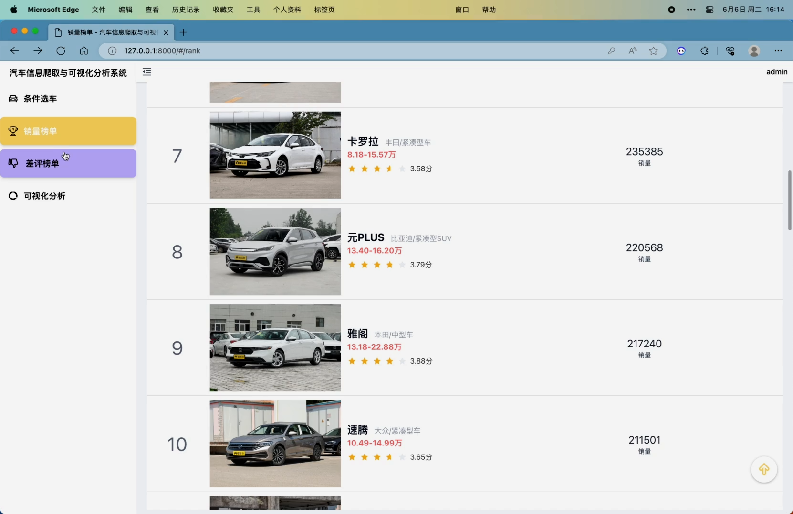

python django django-simpleui scrapy mysql vue3 element-plus echarts vue-router pinia
1. scrapy爬虫抓取“懂车帝”网站的汽车及销量数据，还有“车质网”的汽车投诉数据
2. 条件选车模块，可根据关键词、品牌、价格、燃料类型、座位、车型等条件对车系进行筛选，同时可以按照总分、价格、舒适性、外观、配置、控制、动力、空间、内饰进行排序，该页面在滚动至底部时会自动翻页
3. 销量榜单模块，可对抓取到的近一年、近半年以及每个月的车系销量数据进行统计并展示排名
4. 差评榜单模块，可对抓取到的近一年、近半年以及每个月的车系问题投诉数据进行统计并展示排名，可以筛选三种不同的问题，分别是质量问题、服务问题、其他问题
5. 可视化分析模块，包括车系降价排行榜柱状图可视化(官方价减去经销商价格得到降差价)、汽车品牌数量TOP分布图(分析前30个品牌的车系数量的分布)、价格范围数量分布图(对分布在0-10万 10-15万 15-20万 20-25万 25-30万 30-40万 50万以上价格范围的车系数量进行分析)
6. 车系详情页面，展示了品牌、车系名、经销商报价、厂商报价、近一年销量排名、投诉量排名、评分雷达图分析面板(舒适性 外观 配置 控制 动力 空间 内饰 这6个维度，雷达图中间显示总分)、汽车数据面板展示(百公里加速时间 空调控制方式 行李箱容积 车身结构 整备质量 驱动形式 发动机描述 环保标准 综合油耗 燃料形式 燃油标号 变速箱描述 最高车速 油箱容积 座位数 座椅材料 车系排量 轴距)、
可以通过鼠标左键拖拽或键盘左右键360度查看车系外观图片、以标签形式展示了该车系所有的投诉问题(点击可查看问题详情)、用echarts的Timeline+Wordcloud展示了每个月的质量问题关键词、三种问题的每月投诉量走势图、每月车系销量走势图、每月销量排名走势图
7. 可在后台增删改查管理所有数据
8. 用户登陆注册